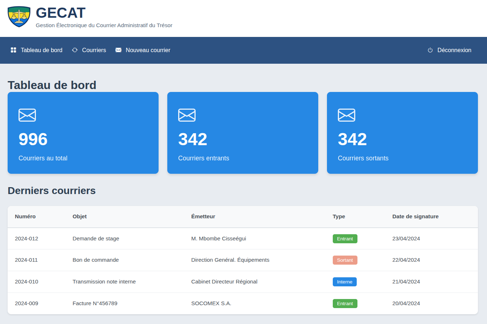
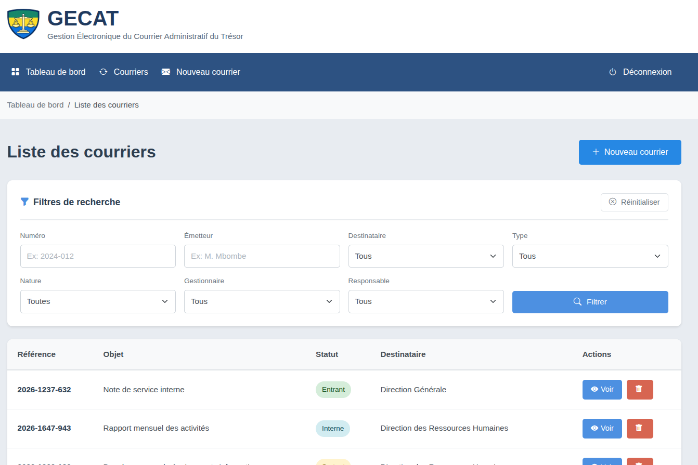
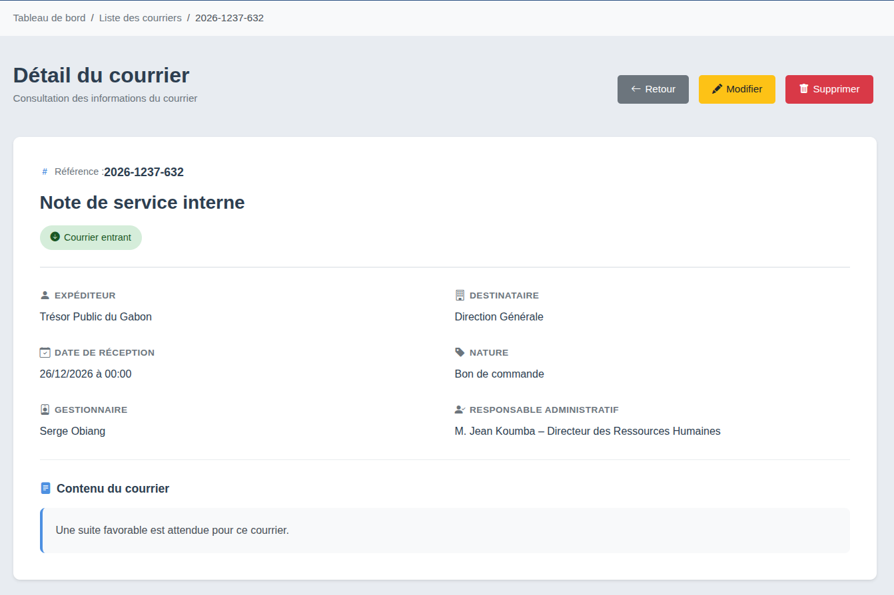
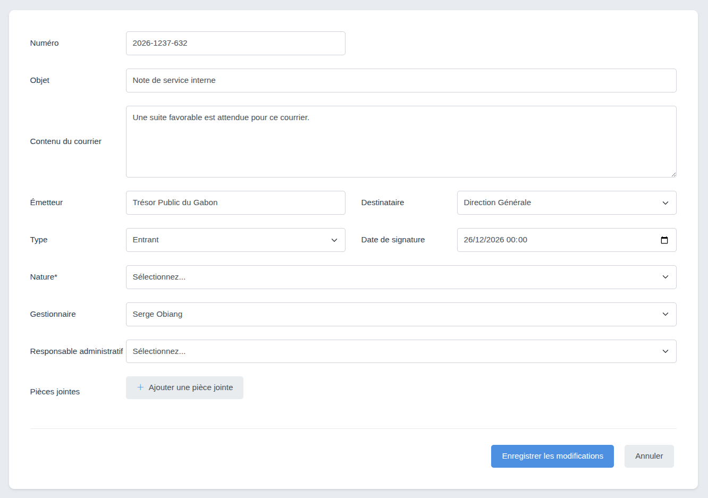
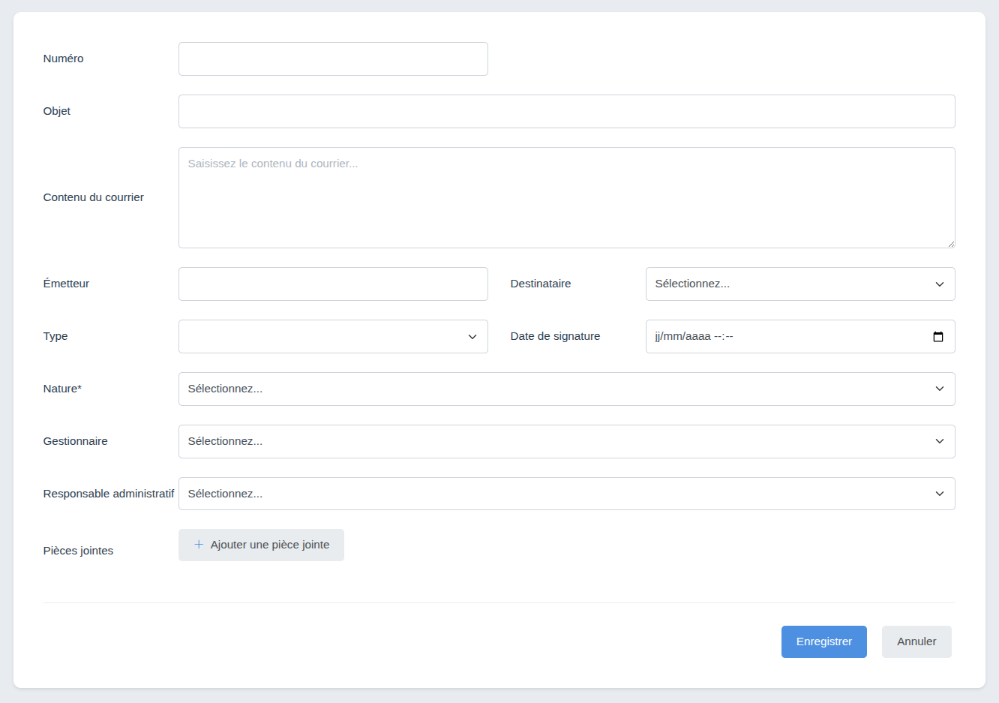

# GECAT - Gestion Électronique du Courrier Administratif du Trésor


## 📋 Description

GECAT est une application web de gestion électronique du courrier administratif développée pour le Trésor Public du Gabon. Elle permet de gérer, suivre et archiver les courriers entrants, sortants et internes de manière efficace et sécurisée.

## ✨ Fonctionnalités

- 🔐 **Authentification sécurisée** - Connexion par email/mot de passe
- 📊 **Tableau de bord** - Vue d'ensemble des statistiques des courriers
- 📨 **Gestion des courriers** - Création, modification, consultation et suppression
- 🔍 **Recherche avancée** - Filtres multiples et autocomplétion
- 📑 **Pagination** - Navigation fluide dans les listes
- 🏷️ **Catégorisation** - Types (entrant/sortant/interne), natures, gestionnaires
- 📎 **Pièces jointes** - Support pour les documents attachés
- 👥 **Gestion des utilisateurs** - Rôles et permissions

## 📸 Captures d'écran

### Page de connexion : http://localhost:8000/
Interface de connexion sécurisée avec validation des identifiants.


### Tableau de bord : http://localhost:8000/dashboard
Vue d'ensemble avec statistiques : courriers au total, courriers entrants et sortants, ainsi que la liste des derniers courriers.



### Liste des courriers : http://localhost:8000/courriers
Tableau avec filtres avancés, autocomplétion et pagination pour naviguer facilement parmi tous les courriers.



### Détail d'un courrier : http://localhost:8000/courrier/id
Affichage complet des informations d'un courrier : référence, objet, expéditeur, destinataire, nature, gestionnaire, responsable et contenu.



### Modification d'un courrier : http://localhost:8000/courrier/id/edit
Formulaire de modification avec tous les champs éditables et gestion des pièces jointes.



### Création d'un courrier : http://localhost:8000/courrier/new
Formulaire de création avec validation des champs obligatoires et upload de pièces jointes.



## 🛠️ Technologies utilisées

- **Framework** : Symfony 7.4
- **Base de données** : PostgreSQL 16
- **PHP** : 8.2+
- **Asset Mapper** : Gestion des assets sans Webpack
- **Docker** : Conteneurisation de l'environnement
- **Bootstrap 5** : Framework CSS
- **Bootstrap Icons** : Icônes

## 📋 Prérequis

Avant de commencer, assurez-vous d'avoir installé :

- **PHP 8.2 ou supérieur**
- **Composer** (gestionnaire de dépendances PHP)
- **Symfony CLI** (interface en ligne de commande Symfony)
- **Docker** et **Docker Compose**
- **Git**
- **IDE recommandé** : PhpStorm, VS Code ou autre

### Vérification des prérequis

```bash
# Vérifier la version de PHP
php -v

# Vérifier Composer
composer --version

# Vérifier Symfony CLI
symfony check:requirements

# Vérifier Docker
docker --version

# Vérifier Docker Compose
docker compose version
```

### Système d'exploitation recommandé

Nous recommandons d'utiliser **Linux Ubuntu** pour un environnement de développement optimal. Le projet fonctionne également sur macOS et Windows (avec WSL2).

## 🚀 Installation

### 1. Cloner le dépôt

```bash
git clone https://github.com/XanderSpartacus/gecat.git
cd gecat
```

### 2. Installer les dépendances PHP

```bash
composer install
```

Cette commande installe toutes les dépendances définies dans `composer.json`.

### 3. Configurer les variables d'environnement

Copiez le fichier `.env` et adaptez-le à votre configuration :

```bash
cp .env .env.local
```

Modifiez les variables si nécessaire (la configuration par défaut fonctionne avec Docker).

### 4. Démarrer les conteneurs Docker

Le fichier `compose.yaml` configure les services suivants :
- **PostgreSQL** : Base de données (port 5432)
- **pgAdmin** : Interface d'administration PostgreSQL (port 8081)
- **Mailpit** : Serveur mail de développement (port 8025)

```bash
# Démarrer tous les conteneurs en arrière-plan
docker compose up -d
```

**Explication de la commande :**
- `docker compose up` : Démarre les services définis dans `compose.yaml`
- `-d` : Mode détaché (les conteneurs tournent en arrière-plan)

**Attendez quelques secondes** que les conteneurs démarrent complètement.

**Autres commandes Docker utiles :**

```bash
# Arrêter les conteneurs (conserve les données)
docker compose down

# Arrêter les conteneurs ET supprimer les volumes (⚠️ supprime toutes les données)
docker compose down -v
```

### 5. Créer la base de données

```bash
# Créer la base de données
php bin/console doctrine:database:create

# Exécuter les migrations pour créer les tables
php bin/console doctrine:migrations:migrate
```

Répondez `yes` quand la commande vous demande confirmation.

### 6. Charger les données de test (fixtures)

```bash
php bin/console doctrine:fixtures:load
```

**⚠️ Attention** : Cette commande supprime toutes les données existantes et charge des données de démonstration.

Cette commande crée notamment un utilisateur administrateur avec les identifiants suivants :
- **Email** : `admin@gecat.ga`
- **Mot de passe** : `password`

### 7. Démarrer le serveur web Symfony

```bash
symfony server:start
```

Le serveur démarre sur **http://127.0.0.1:8000** par défaut.

**Pour arrêter le serveur :**

```bash
symfony server:stop
```

## 🔗 Accès à l'application

Une fois l'installation terminée, vous pouvez accéder aux différents services :

| Service | URL | Identifiants |
|---------|-----|--------------|
| **Application GECAT** | http://127.0.0.1:8000 | admin@gecat.ga / password |
| **pgAdmin** | http://127.0.0.1:8081/browser/ | admin@gecat.com / admin |
| **Mailpit** (emails) | http://127.0.0.1:8025 | Aucun identifiant requis |

### Compte administrateur par défaut

Pour vous connecter à GECAT :
- **Email** : `admin@gecat.ga`
- **Mot de passe** : `password`

> ⚠️ **Important** : Changez ces identifiants en production !

## 📚 Documentation

- [Symfony 7.4](https://symfony.com/doc/7.4) - Documentation officielle de Symfony
- [Doctrine ORM](https://www.doctrine-project.org/projects/doctrine-orm/en/latest/index.html) - ORM pour la base de données
- [Twig](https://twig.symfony.com/doc/3.x/) - Moteur de templates
- [Bootstrap 5](https://getbootstrap.com/docs/5.3/) - Framework CSS

## 🔧 Commandes utiles

### Serveur Symfony

```bash
# Démarrer le serveur web
symfony server:start

# Démarrer en arrière-plan
symfony server:start -d

# Arrêter le serveur
symfony server:stop

# Voir les logs du serveur
symfony server:log
```

### Docker

```bash
# Démarrer les conteneurs
docker compose up -d

# Voir les logs des conteneurs
docker compose logs

# Voir les logs en temps réel
docker compose logs -f

# Voir les logs d'un service spécifique
docker compose logs database

# Arrêter les conteneurs
docker compose down

# Arrêter et supprimer les volumes (⚠️ supprime les données)
docker compose down -v

# Redémarrer un service spécifique
docker compose restart database

# Voir l'état des conteneurs
docker compose ps
```

### Base de données

```bash
# Créer la base de données
php bin/console doctrine:database:create

# Supprimer la base de données
php bin/console doctrine:database:drop --force

# Créer une migration
php bin/console make:migration

# Exécuter les migrations
php bin/console doctrine:migrations:migrate

# Annuler la dernière migration
php bin/console doctrine:migrations:migrate prev

# Charger les fixtures
php bin/console doctrine:fixtures:load

# Voir l'état des migrations
php bin/console doctrine:migrations:status
```

### Cache

```bash
# Vider le cache
php bin/console cache:clear

# Vider le cache en environnement de production
php bin/console cache:clear --env=prod

# Préchauffer le cache
php bin/console cache:warmup
```

### Asset Mapper

Le projet utilise **Asset Mapper** pour gérer les assets (CSS, JavaScript) sans Webpack.

```bash
# Compiler les assets
php bin/console asset-map:compile

# Lister tous les assets
php bin/console debug:asset-map

# Importer un package NPM
php bin/console importmap:require package-name
```

### Génération de code

```bash
# Créer une entité
php bin/console make:entity

# Créer un contrôleur
php bin/console make:controller

# Créer un formulaire
php bin/console make:form

# Créer un repository
php bin/console make:repository

# Créer des fixtures
php bin/console make:fixtures

# Voir toutes les commandes disponibles
php bin/console make:
```

### Debug

```bash
# Lister toutes les routes
php bin/console debug:router

# Afficher une route spécifique
php bin/console debug:router app_courrier_list

# Lister tous les services
php bin/console debug:container

# Afficher la configuration
php bin/console debug:config

# Vérifier les exigences Symfony
symfony check:requirements
```

## 🏗️ Structure du projet

```
gecat/
├── config/              # Configuration de l'application
│   ├── packages/       # Configuration des bundles
│   └── routes.yaml     # Définition des routes
├── migrations/          # Migrations de base de données
├── public/              # Point d'entrée web et assets publics
│   ├── assets/         # CSS et JavaScript
│   │   ├── filters.css
│   │   ├── autocomplete.css
│   │   ├── pagination.css
│   │   └── ...
│   └── images/         # Images (logo, etc.)
├── src/
│   ├── Controller/     # Contrôleurs
│   │   └── CourrierController.php
│   ├── Entity/         # Entités Doctrine
│   │   ├── Courrier.php
│   │   └── User.php
│   ├── Form/           # Formulaires
│   │   └── CourrierType.php
│   ├── Repository/     # Repositories
│   │   └── CourrierRepository.php
│   └── DataFixtures/   # Fixtures pour les données de test
├── templates/          # Templates Twig
│   ├── base.html.twig  # Template de base
│   ├── courrier/       # Templates des courriers
│   │   ├── index.html.twig
│   │   ├── show.html.twig
│   │   ├── new.html.twig
│   │   └── edit.html.twig
│   └── security/       # Templates d'authentification
│       └── login.html.twig
├── var/                # Fichiers générés (cache, logs)
├── compose.yaml        # Configuration Docker Compose
├── composer.json       # Dépendances PHP
└── .env                # Variables d'environnement
```

## 🔒 Sécurité

- Les mots de passe sont hashés avec l'algorithme `auto` de Symfony (bcrypt/argon2)
- Protection CSRF sur tous les formulaires
- Validation des données côté serveur
- Authentification basée sur les sessions
- Contrôle d'accès par rôles (ROLE_USER, ROLE_ADMIN)

## 🐛 Dépannage

### Le serveur ne démarre pas

```bash
# Vérifier si le port 8000 est déjà utilisé
symfony server:stop
lsof -i :8000

# Démarrer sur un autre port
symfony server:start --port=8001
```

### Erreur de connexion à la base de données

```bash
# Vérifier que les conteneurs Docker sont démarrés
docker compose ps

# Redémarrer le conteneur de base de données
docker compose restart database

# Vérifier les logs
docker compose logs database

# Recréer complètement les conteneurs
docker compose down -v
docker compose up -d
```

### Erreur "Class not found"

```bash
# Régénérer l'autoload de Composer
composer dump-autoload

# Vider le cache
php bin/console cache:clear
```

### Permission denied

```bash
# Sur Linux/Mac, donner les bonnes permissions
chmod -R 777 var/

# Ou utiliser l'utilisateur courant
sudo chown -R $USER:$USER var/
```

### Erreur de migration

```bash
# Voir l'état des migrations
php bin/console doctrine:migrations:status

# Supprimer la base et recommencer
php bin/console doctrine:database:drop --force
php bin/console doctrine:database:create
php bin/console doctrine:migrations:migrate
php bin/console doctrine:fixtures:load
```

### Les assets ne se chargent pas

```bash
# Compiler les assets
php bin/console asset-map:compile

# Vider le cache
php bin/console cache:clear
```

## 🤝 Contribution

Les contributions sont les bienvenues ! Pour contribuer :

1. Forkez le projet
2. Créez une branche pour votre fonctionnalité (`git checkout -b feature/AmazingFeature`)
3. Committez vos changements (`git commit -m 'Add some AmazingFeature'`)
4. Poussez vers la branche (`git push origin feature/AmazingFeature`)
5. Ouvrez une Pull Request

### Standards de code

- Suivre les [Symfony Best Practices](https://symfony.com/doc/current/best_practices.html)
- Utiliser PSR-12 pour le style de code PHP
- Commenter le code complexe
- Écrire des tests pour les nouvelles fonctionnalités

## 📝 Licence

Ce projet est sous licence propriétaire. Tous droits réservés.

## 👥 Auteurs

- **XanderSpartacus** - *Développeur principal* - [GitHub](https://github.com/XanderSpartacus)

## 🙏 Remerciements

- Le Trésor Public du Gabon
- La communauté Symfony
- Tous les contributeurs

## 📞 Support

Pour toute question ou problème :
- Ouvrez une issue sur GitHub : [Issues](https://github.com/XanderSpartacus/gecat/issues)
- Consultez la [documentation Symfony](https://symfony.com/doc/7.4)

---

**Développé pour le Trésor Public du Gabon**

© 2026 - GECAT - Gestion Électronique du Courrier Administratif du Trésor
